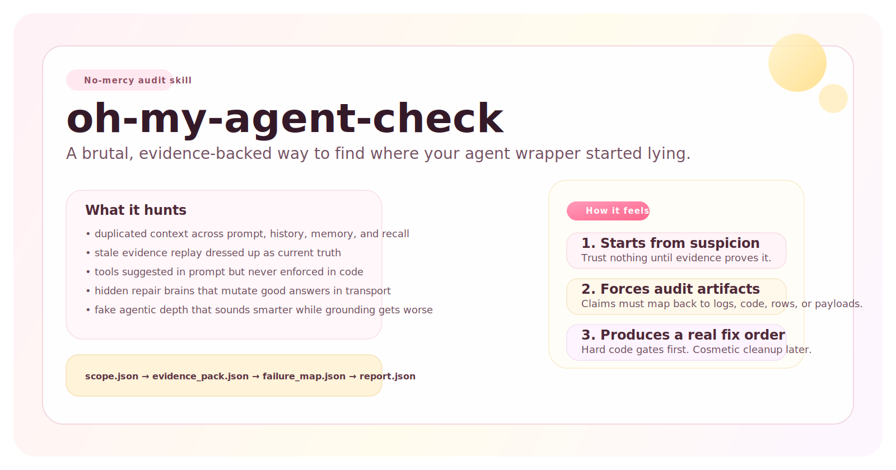
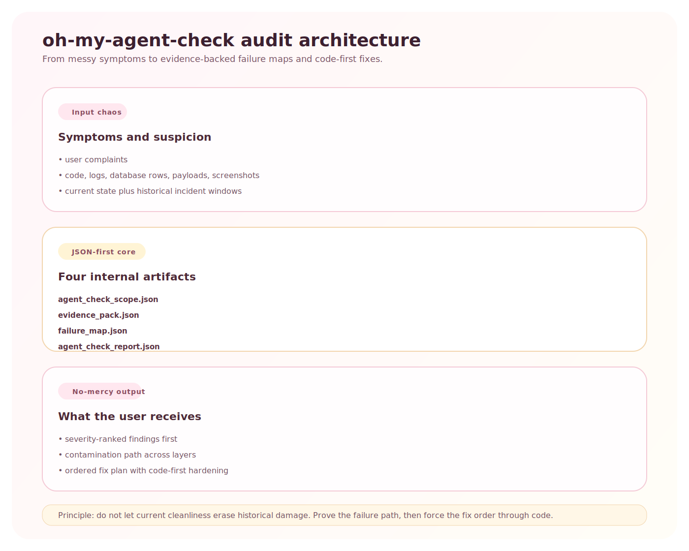
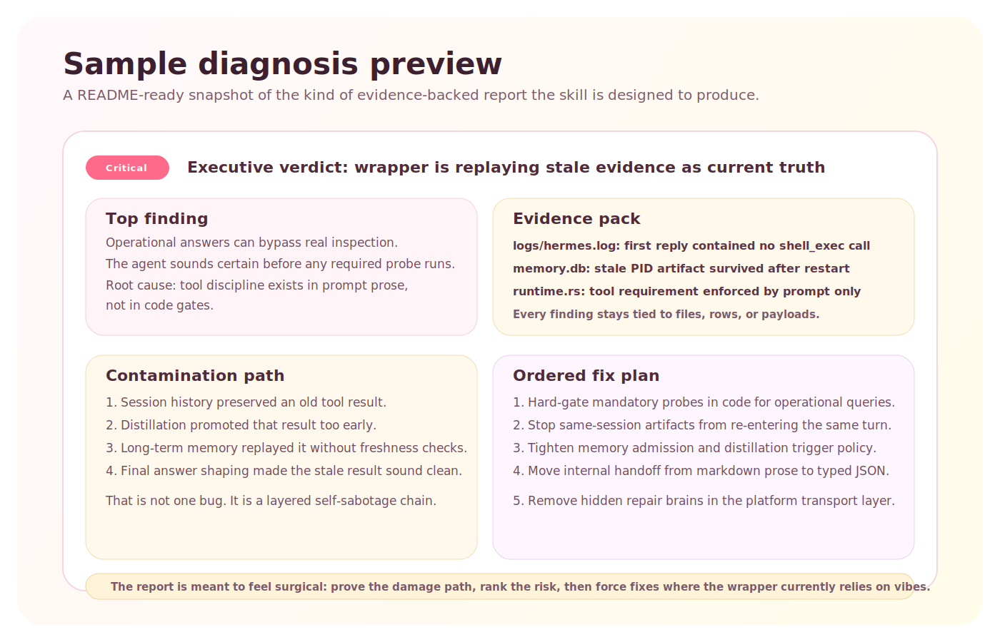
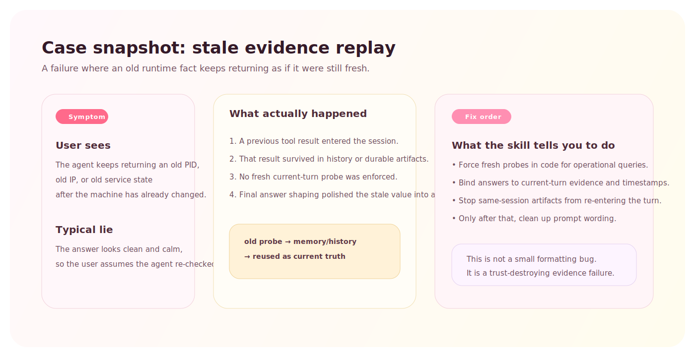
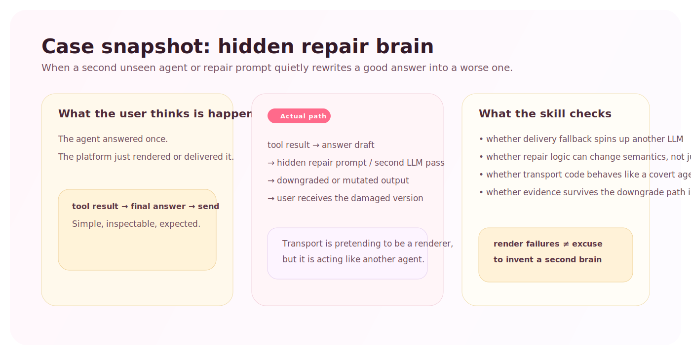

# oh-my-agent-check

Brutally strict, JSON-first agent-wrapper audit skill.

This is not a "nice review" skill. It is a **no-mercy diagnostic instrument** for agent systems that:

- sound smarter than they are
- hide failures behind extra layers
- mutate good evidence into bad answers
- blame the base model when the wrapper is the real problem

## Why This Exists

Many agent systems do not fail because the model is bad.

They fail because the wrapper becomes a stack of self-sabotage:

- system prompt
- session history
- long-term memory
- distillation
- active recall
- tool selection
- tool execution
- tool interpretation
- answer shaping
- platform rendering
- hidden repair agents
- stale persistence

This skill is designed to inspect that whole stack with evidence instead of vibes.

## Architecture

The architecture is simple on purpose:

1. Start with symptoms, suspicion, and historical evidence.
2. Convert the audit into structured artifacts instead of freestyle prose.
3. Render a severity-ranked verdict that points at wrapper failures, not excuses.

## Demo Output

This is the tone and shape the skill is aiming for:

- findings first
- contamination path second
- code-first fix order third

## Case Snapshots

These are the kinds of failures the skill is designed to expose without flinching.

### 1. Stale evidence replay

This catches wrappers that keep answering with old facts because history, memory, or persistence got replayed as if it were a fresh probe.

### 2. Hidden repair brain

This catches platforms that secretly run a second prompt or LLM pass and quietly mutate an answer during fallback or delivery.

## What It Audits

Any agent system itself:

- CLI coding agents
- long-running assistant runtimes
- browser agents
- wrapper-based copilots
- memory-heavy assistants
- tool-using autonomous loops

## Questions It Is Built To Answer

- Why does this wrapped agent behave worse than the base model?
- Which layer first corrupted the answer?
- Which layer amplified the corruption?
- Where is the hidden prompt conflict?
- Which memory path is polluting new turns?
- Which fallback loop is mutating correct answers into bad ones?
- Which fixes must be code-enforced instead of prompt-enforced?

## What It Produces

Internally, the audit moves through four structured artifacts:

1. `agent_check_scope.json`
2. `evidence_pack.json`
3. `failure_map.json`
4. `agent_check_report.json`

The final human-readable answer should be rendered from the structured report instead of improvised from memory.

## Audit Modes

Core playbooks:

- `wrapper-regression`
- `memory-contamination`
- `tool-discipline`
- `rendering-transport`
- `hidden-agent-layers`

Advanced playbooks:

- `false-confidence`
- `stale-evidence-replay`
- `fake-agentic-depth`
- `hidden-repair-brain`
- `memory-poisoning`
- `protocol-decay`

See:

- `references/playbooks.md`
- `references/advanced-playbooks.md`
- `references/trigger-prompts.md`

## What Makes It Different

- It does not default to blaming the base model.
- It does not let current cleanliness erase historical incidents.
- It does not treat markdown prose as a trustworthy internal protocol.
- It does not accept "must use tool" as prompt text if code never enforces it.
- It prefers wrapper causality over decorative summaries.

## Example Prompt

Use `$oh-my-agent-check` to audit this agent runtime like it is lying about its own health. Focus on wrapper-regression and tool-discipline, inspect yesterday's incidents instead of only current code, and give me a severity-ranked diagnosis with code-enforced fixes first.

## Package Contents

- `SKILL.md`
- `agents/openai.yaml`
- `assets/pig-icon.svg`
- `assets/architecture-diagram.svg`
- `assets/demo-report.svg`
- `references/report-schema.json`
- `references/rubric.md`
- `references/playbooks.md`
- `references/advanced-playbooks.md`
- `references/trigger-prompts.md`
- `references/example-report.json`
- `references/framework-directions.md`
- `references/governance-framework.md`
- `references/clawhub-publish.md`

## Design Principles

This package is intentionally:

- JSON-first
- evidence-backed
- hostile to hand-wavy explanations
- focused on wrapper architecture, not user-task completion
- biased toward code-control over prompt-control
- optimized for uncovering hidden failure paths, not preserving feelings

## Publishing Notes

This repository is prepared as a standalone skill package suitable for publishing to GitHub and packaging for distribution channels that accept Codex-style skill folders.
