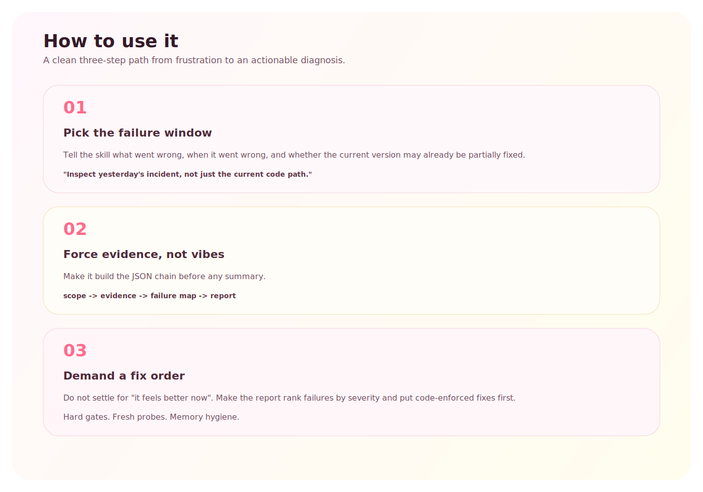
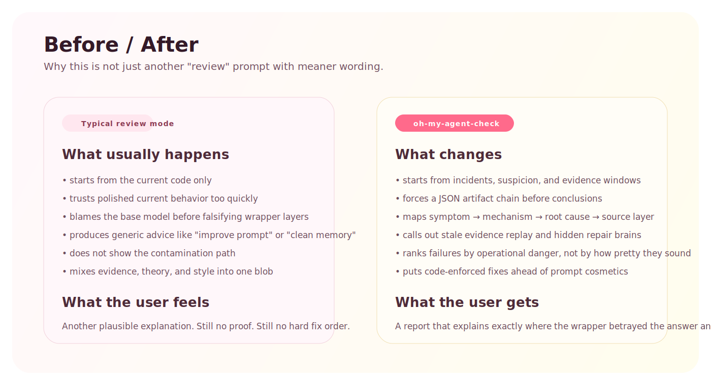

# oh-my-agent-check

严厉、JSON-first 的 agent wrapper 审查技能。

这不是一个“温和 review”技能。它是一个**不留情面的诊断工具**，专门用来查这类系统为什么会越套壳越差：

- 看起来更聪明，实际上更不可靠
- 外层包了太多层之后开始互相打架
- 明明拿到了证据，却在后处理里把答案改坏
- 最后所有锅都甩给底层模型

## 它为什么存在

很多 agent 系统变差，不是因为模型本身弱，而是因为 wrapper 叠成了一条自我破坏链：

- system prompt
- session history
- 长期记忆
- distillation
- active recall
- tool selection
- tool execution
- tool interpretation
- answer shaping
- platform rendering
- hidden repair agents
- stale persistence

这个技能就是用来审这整条链的，而且要求用证据说话，不靠感觉。

## 架构图

核心思路很直接：

1. 从症状、怀疑点、事故时间窗开始。
2. 先把审查结果收进结构化 JSON 工件。
3. 再输出按严重度排序的诊断结论和修复顺序。

## 演示效果

它要产出的不是“泛泛而谈的建议”，而是：

- findings first
- contamination path second
- code-first fix order third

## 如何使用

最短路径就是：

1. 指向真正出问题的时间窗，而不是只看当前版本。
2. 先强制走 JSON 工件链，再写 prose 结论。
3. 要求把 code-enforced fixes 放在 prompt cosmetic fixes 前面。

## 为什么它更狠

它和普通 review 的区别在于：

- 更少空话
- 更少礼貌性粉饰
- 更关注污染路径，而不是泛泛 best practices
- 更敢直接指出 wrapper 才是真问题

## 典型案例

### 1. Stale evidence replay

它能抓到这种问题：旧的 tool 结果、旧 session 状态、旧 artifact 被当成当前事实重复回答。

### 2. Hidden repair brain

它也会抓这种问题：平台层或 fallback 层偷偷再跑一轮 LLM，把本来正确的答案改坏。

## 它审什么

- CLI coding agents
- long-running assistant runtimes
- browser agents
- wrapper-based copilots
- memory-heavy assistants
- tool-using autonomous loops

## 它回答什么问题

- 为什么同一个模型，套壳后反而变差？
- 哪一层先污染了答案？
- 哪一层把错误放大了？
- 哪些修复必须代码化，而不是继续堆 prompt？
- 哪些“智能层”其实只是新增了失败面？

## 它会产出什么

内部会先形成四个结构化工件：

1. `agent_check_scope.json`
2. `evidence_pack.json`
3. `failure_map.json`
4. `agent_check_report.json`

最后给人的总结应该从这些结构化结果渲染出来，而不是临时编一套解释。

## 审查模式

核心 playbooks：

- `wrapper-regression`
- `memory-contamination`
- `tool-discipline`
- `rendering-transport`
- `hidden-agent-layers`

更狠的 playbooks：

- `false-confidence`
- `stale-evidence-replay`
- `fake-agentic-depth`
- `hidden-repair-brain`
- `memory-poisoning`
- `protocol-decay`

## 包含内容

- `SKILL.md`
- `agents/openai.yaml`
- `assets/pig-icon.svg`
- `assets/architecture-diagram.svg`
- `assets/demo-report.svg`
- `assets/how-to-use.svg`
- `assets/before-after.svg`
- `references/report-schema.json`
- `references/rubric.md`
- `references/playbooks.md`
- `references/advanced-playbooks.md`
- `references/trigger-prompts.md`
- `references/example-report.json`
- `references/framework-directions.md`
- `references/governance-framework.md`
- `references/clawhub-publish.md`
